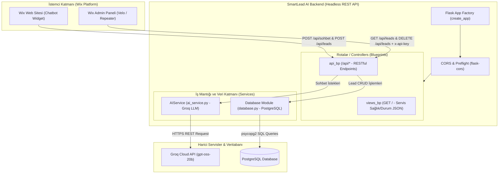

# 🏗️ SmartLead AI - Sistem Mimarisi Raporu

Bu doküman, **SmartLead AI** projesinin teknik mimarisini, bileşen ilişkilerini, veri akışlarını, güvenlik katmanlarını ve veritabanı yapısını özlü ve anlaşılır bir biçimde sunmaktadır.

---

## 1. 📌 Genel Bakış (Overview)

**SmartLead AI**, potansiyel müşterilerin (lead) sorularını yapay zekâ desteğiyle yanıtlayan, gelen iletişim/başvuru bilgilerini PostgreSQL veritabanında saklayan ve yönetilmesini sağlayan Flask tabanlı modüler bir web servisi ve API mimarisidir.

### Temel Hedefler:
- **Otomatik Müşteri Desteği:** Groq API entegrasyonu ile esnek sistem talimatları (*Business Context*) altında müşterilerle etkileşim kurma.
- **Lead Yönetimi:** Gelen isim, telefon ve mesaj bilgilerini doğrulayarak veritabanına kaydetme ve yönetim paneline/dış platformlara (Wix vb.) sunma.
- **Güvenli ve Esnek API:** API Key ve CORS denetimleriyle dış entegrasyonları destekleme.

---

## 2. 🛠️ Teknoloji Yığını (Tech Stack)

| Katman | Teknoloji / Kütüphane | Açıklama |
| :--- | :--- | :--- |
| **Backend Framework** | Python 3, Flask | Uygulama çatısı ve RESTful API servisi |
| **WSGI / Web Server** | Gunicorn | Production ortamı HTTP sunucusu |
| **Veritabanı** | PostgreSQL (`psycopg2-binary`) | Lead verilerinin saklandığı ilişkisel veritabanı |
| **AI Servis Entegrasyonu** | Groq API (`requests`) | LLM model entegrasyonu (gpt-oss / Llama / Qwen modelleri) |
| **Güvenlik & CORS** | `flask-cors`, Custom Middleware | Cross-Origin istek yönetimi ve API Key doğrulaması |
| **Yapılandırma** | `python-dotenv`, `config.py` | Ortam değişkenleri ve yapılandırma yönetim sınıfları |

---

## 3. 📐 Sistem Mimarisi ve Bileşen Şeması

Proje, HTML şablon katmanından arındırılmış **100% Headless RESTful API** mimarisinde tasarlanmıştır. Ön yüz (kullanıcı sohbet arayüzü ve yönetim paneli) tamamen **Wix (Velo / Custom Element)** tarafında barındırılır. Flask uygulaması ise **Flask Application Factory** (`create_app`) ve **Blueprint** desenleriyle modüler bir mikro servis olarak çalışır.

### Mimari Bileşen Şeması:



### Bileşen Sorumlulukları ve Akış Mantığı:

1. **Wix İstemci Katmanı (Frontend):**
   - **Chatbot Widget:** Müşterinin gönderdiği sohbet mesajlarını `/api/sohbet` rotasına `POST` eder. Müşteri bilgilerini ise `/api/leads` rotasına gönderir.
   - **Wix Admin Paneli:** Kayıtlı leadleri listelemek veya silmek için `x-api-key` korumalı `/api/leads` uç noktalarına güvenli `GET` ve `DELETE` istekleri atar.

2. **Flask Backend Katmanı (Headless API):**
   - **`views_bp` (`/`):** Sunucunun aktif olup olmadığını kontrol eden durum JSON'ı döner (`index.html` ve `dashboard.html` HTML bağımlılıkları tamamen kaldırılmıştır).
   - **`api_bp` (`/api/*`):** Tüm JSON REST API isteklerini karşılar ve doğrulama sonrasında ilgili servise iletir.
   - **`CORS Middleware`:** Wix origin'lerinden gelen Cross-Origin isteklerine ve `OPTIONS` (Preflight) sorgularına izin verir.

3. **İş Mantığı ve Harici Entegrasyonlar:**
   - **`AIService`:** Gelen mesaj geçmişini sınırlayarak sistem talimatıyla birlikte Groq API'ye iletir ve üretilen metni döndürür.
   - **`Database Module`:** PostgreSQL veritabanına bağlantı açıp kapatır, gelen lead verilerini saklar ve Wix uyumlu (`_id` alanlı) JSON formatında listeler.

---

## 4. 🗄️ Veri Modeli ve Şeması (Data Schema)

Veritabanı işlemleri `app/database.py` modülü üzerinden yürütülür. İstek başına bağlantı (`flask.g`) açılıp kapanır.

### `leads` Tablosu
Müşteri adaylarının bilgilerini saklayan ana tablodur.

```sql
CREATE TABLE IF NOT EXISTS leads (
    id SERIAL PRIMARY KEY,
    isim VARCHAR(255) NOT NULL,
    telefon VARCHAR(50) NOT NULL,
    mesaj TEXT,
    tarih TIMESTAMP DEFAULT CURRENT_TIMESTAMP
);
```

> **Wix ve Dış Sistem Uyumluluğu:**
> API çıktısında `id` değeri metin (string) tipine dönüştürülür ve Wix Repeater/Table bileşenlerinin beklediği `_id` alanı otomatik olarak JSON yanıtına eklenir.

---

## 5. 🔌 API Rotaları ve Veri Akışı

Uygulama iki temel Blueprint sunar: `views_bp` (sayfalar) ve `api_bp` (`/api` altındaki JSON REST API).

| Yöntem | Rota | Açıklama | Güvenlik / Yetki |
| :--- | :--- | :--- | :--- |
| `GET` | `/health` | Sunucu canlılık kontrolü (*Health check*) | Açık |
| `GET` | `/` | Karşılama şablonu | Açık |
| `GET` | `/dashboard` | Yönetim paneli | Açık |
| `POST` | `/api/sohbet` | AI asistandan yanıt üretme | Açık |
| `POST` | `/api/leads` | Yeni lead kaydı ekleme | Açık |
| `GET` | `/api/leads` | Tüm leadleri listeleme | `x-api-key` veya Dahili Referer |
| `DELETE` | `/api/leads/<id>` | Lead kaydı silme | `x-api-key` veya Dahili Referer |

### AI Sohbet Akışı (`/api/sohbet`):
1. Kullanıcıdan `mesaj` ve isteğe bağlı sohbet `gecmis` listesi alınır.
2. `AIService`, son 6 mesajı (3 konuşma turu) alır ve sistem istemini (`BUSINESS_CONTEXT`) ekler.
3. Groq API Key tanımlıysa `https://api.groq.com/openai/v1/chat/completions` uç noktasına istek atılır.
4. API Key yoksa veya boşsa sistem güvenli **Demo Modu**nda yanıt döner.

---

## 6. 🔐 Güvenlik ve Yapılandırma Mimarisi

- **Ortam Yönetimi:** `config.py` içinde `DevelopmentConfig` ve `ProductionConfig` sınıfları bulunur. `FLASK_ENV` değişkenine göre otomatik seçilir.
- **CORS Politikası:** `flask-cors` ile tüm origin ve metodlara kontrollü başlık geçişleri tanımlanmıştır. Preflight (`OPTIONS`) istekleri 204 No Content yanıtı ile karşılanır.
- **Erişim Koruması:** `/api/leads` GET ve DELETE uç noktalarında `x-api-key` başlığı doğrulanır (`/dashboard` harici dış çağrılar için).
- **Veritabanı URL Uyumluluğu:** PaaS sağlayıcılarındaki (örn. Render) `postgres://` bağlantı dizesi otomatik olarak `postgresql://` biçimine dönüştürülür.

---

## 7. 📁 Proje Dizin Yapısı

```
smartlead_ai/
├── app/
│   ├── services/
│   │   └── ai_service.py   # Groq AI entegrasyonu & istem yönetimi
│   ├── templates/          # HTML arayüz şablonları
│   ├── database.py         # PostgreSQL bağlantı & sorgu yönetimi
│   ├── routes.py           # API & Sayfa Blueprint rotaları
│   └── __init__.py         # App factory & CORS yapılandırması
├── config.py               # Yapılandırma sınıfları (Dev/Prod)
├── run.py                  # Sunucu başlatıcı (Entry point)
├── SISTEM_MIMARISI.md      # Sistem mimarisi dokümanı
├── requirements.txt        # Bağımlılık listesi
└── .env                    # Çevre değişkenleri
```

---

## 8. 🚀 Dağıtım (Deployment) & Çalıştırma

1. **Geliştirme Ortamı:** `python run.py` (Flask Built-in WSGI Server)
2. **Üretim Ortamı (Production):** `gunicorn run:app` (PostgreSQL ve `.env` yapılandırması ile)
